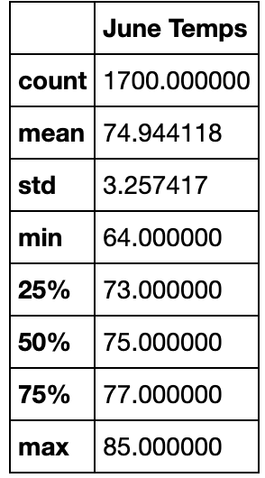

# Surfs Up Analysis
## Overview
### Purpose
The purpose of this analysis was to show the investors of "Surf's Up" shop the historical weather in Oahu, Hawaii. The investors need to know if the weather would be suitable for year-round revenue and profits for the surf and ice cream shop. 

## Results
The results of the analysis were successful. As you can see in both statistics of June and December weather data, they have similar weather patterns. The following have the most different statistics:
- Lowest temperature
- Count of temperatures
- Highest temperature

December, as expected, as the lowest temperature of the two with almost a 10 degree difference. 

###### June Statistics

###### December Statistics
