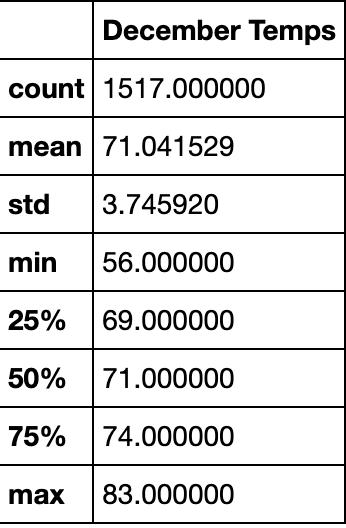

# Surfs Up Analysis
## Overview
### Purpose
The purpose of this analysis was to show the investors of "Surf's Up" shop the historical weather in Oahu, Hawaii. The investors need to know if the weather would be suitable for year-round revenue and profits for the surf and ice cream shop. 

## Results
The results of the analysis were successful. As you can see in both statistics of June and December weather data, they have similar weather patterns. The following have the most different statistics:
- Lowest temperature
- Count of temperatures
- Highest temperature

December, as expected, as the lowest temperature of the two with almost a 10 degree difference. This could mean that both the ice cream and surf shop are going to be less profitable in December with temperatures like that; but, the average temperatures are very close, with only a 3 degree less in December. The amount of data for June and December are different as well. This means that December could have a higher average if there was more data. Another difference is the highest temperature. Only being a couple degrees lower, December weather is pretty good in comparison to June's. 

###### June Statistics

###### December Statistics

## Summary
I believe that the analysis of the weather in both June and December have a lot of similarities. The highest and average temperatures were pretty close in degrees, making this surf shop profitable in both June and December in Oahu.
